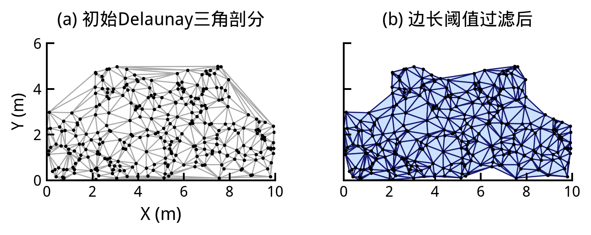
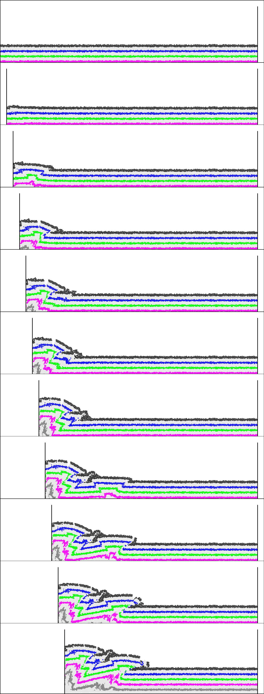

# ZDEM Area Conservation

**Particle distribution & area-conservation analysis for ZDEM — triangulation stats + paper-style figures.**

[English](README.md) | [中文](README.zh-CN.md)

[](https://github.com/Phoenix0531-sudo/ZDEM_Area_Conservation/actions/workflows/ci.yml)
[](LICENSE)
[](https://www.python.org/)

Particle distribution & area-conservation analysis for ZDEM — triangulation stats + paper-style figures.

Samples-first. No multi-GB dumps required for CI.


## Screenshots

<table>
<tr><td width="50%"><br><em>Figure panel</em></td><td width="50%"><br><em>Stitched figure</em></td></tr>
</table>

## Features

- 📐 Triangulation-oriented area conservation metrics
- 🧾 `zdemio` / `zdemplot` helpers for ZDEM dumps
- 🖼️ Paper-style figure scripts (`fig*.py`)
- 🧪 `samples/` mini `.dat` for tests without multi-GB data
- ✅ Hard CI on samples + ruff critical rules

## Get started

### Install

```bash
git clone https://github.com/Phoenix0531-sudo/ZDEM_Area_Conservation.git
cd ZDEM_Area_Conservation
pip install -r requirements.txt
# or: uv sync
```

### Usage

```bash
python Area_Conservation.py --help
pytest tests/
```

Large personal dumps stay local (`data/`, `figures/` full sets) — do not force-push them.

## Project layout

```
Area_Conservation.py  zdemio.py  zdemplot.py
samples/  figures/  docs/screenshots/
tests/
```

## Related ZDEM tools

| Repo | Role |
|------|------|
| [ZDEM_ParticleTracker](https://github.com/Phoenix0531-sudo/ZDEM_ParticleTracker) | Interactive particle tracking + VisPy true-radius render |
| [ZDEM_Salt_Kinematics](https://github.com/Phoenix0531-sudo/ZDEM_Salt_Kinematics) | Salt geometry / kinematics extraction & plots |
| [ZDEM_Area_Conservation](https://github.com/Phoenix0531-sudo/ZDEM_Area_Conservation) | Area-conservation / triangulation analysis |
| [ZDEM_Bond_Fracture](https://github.com/Phoenix0531-sudo/ZDEM_Bond_Fracture) | Bond damage series + desktop / CLI |
| [ZDEM_Damage_Thresholds](https://github.com/Phoenix0531-sudo/ZDEM_Damage_Thresholds) | Damage thresholds & strain–energy plots |
| [ZDEM_DFN](https://github.com/Phoenix0531-sudo/ZDEM_DFN) | Discrete fracture network generator for ZDEM |
| [ZDEM_Model_Editor](https://github.com/Phoenix0531-sudo/ZDEM_Model_Editor) | Model file visual editor |
| [ZDEM_Archiver](https://github.com/Phoenix0531-sudo/ZDEM_Archiver) | Purge / archive bulky simulation dumps |
| [ZDEM3D_WEB](https://github.com/Phoenix0531-sudo/ZDEM3D_WEB) | CAE cloud UI (Django + React + VTK.js) |

## Notes

Automating triangulation + stats beats ad-hoc MATLAB leftovers for reproducible lab reports.

## License

MIT. Free for commercial use with attribution where applicable. See [LICENSE](LICENSE).
