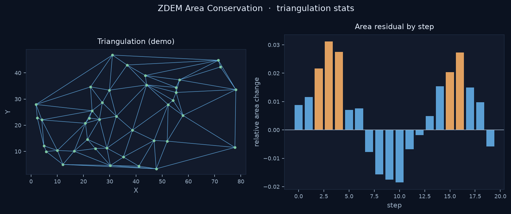

# ZDEM Area Conservation

**Particle distribution and area-conservation analysis for ZDEM with paper-style figures.**

[English](README.md) | [中文](README.zh-CN.md)

[](https://github.com/Phoenix0531-sudo/ZDEM_Area_Conservation/actions/workflows/ci.yml)
[](LICENSE)

Samples-first. CI does not need multi-GB dumps.

## Preview



## Features

- Triangulation-oriented area conservation metrics
- zdemio / zdemplot helpers for ZDEM dumps
- Paper-style figure scripts (fig*.py)
- samples/ mini .dat for reproducible tests
- Hard CI on samples + critical ruff rules

## Get started

### Install

```bash
git clone https://github.com/Phoenix0531-sudo/ZDEM_Area_Conservation.git
cd ZDEM_Area_Conservation
pip install -r requirements.txt
```

### Usage

```bash
python Area_Conservation.py --help
pytest tests/
```

## Project layout

```
Area_Conservation.py  zdemio.py  zdemplot.py
samples/  figures/  docs/screenshots/
tests/
```

## Related ZDEM tools

| Repo | Role |
|------|------|
| [ZDEM_ParticleTracker](https://github.com/Phoenix0531-sudo/ZDEM_ParticleTracker) | Interactive particle tracking + true-radius render |
| [ZDEM_Salt_Kinematics](https://github.com/Phoenix0531-sudo/ZDEM_Salt_Kinematics) | Salt geometry / kinematics extraction and plots |
| [ZDEM_Area_Conservation](https://github.com/Phoenix0531-sudo/ZDEM_Area_Conservation) | Area-conservation / triangulation analysis |
| [ZDEM_Bond_Fracture](https://github.com/Phoenix0531-sudo/ZDEM_Bond_Fracture) | Bond damage series + visualizer |
| [ZDEM_Damage_Thresholds](https://github.com/Phoenix0531-sudo/ZDEM_Damage_Thresholds) | Damage thresholds and energy plots |
| [ZDEM_DFN](https://github.com/Phoenix0531-sudo/ZDEM_DFN) | Discrete fracture network generator |
| [ZDEM_Model_Editor](https://github.com/Phoenix0531-sudo/ZDEM_Model_Editor) | Model file visual editor |
| [ZDEM_Archiver](https://github.com/Phoenix0531-sudo/ZDEM_Archiver) | Archive / purge bulky dumps |
| [ZDEM3D_WEB](https://github.com/Phoenix0531-sudo/ZDEM3D_WEB) | CAE cloud UI (Django + React + VTK.js) |


## Notes

Keep personal multi-GB dumps local; do not force-push datasets.

## License

MIT. Free for commercial use with attribution where applicable. See [LICENSE](LICENSE).
